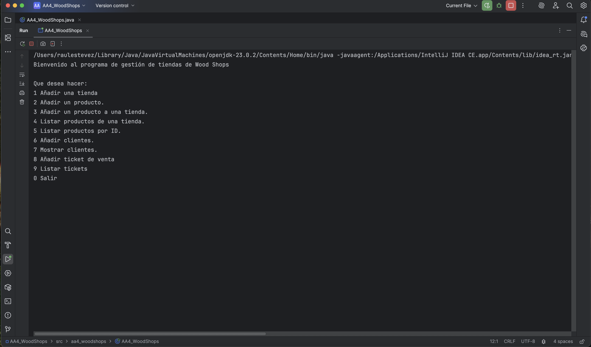
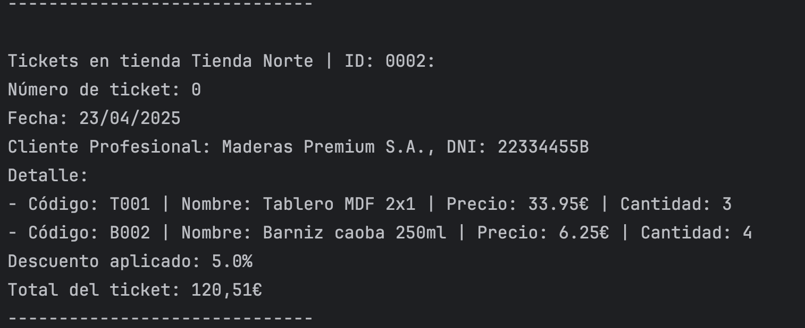

# WoodShop_Java

**WoodShop_Java** is a store management system specialized in selling wood products and varnishes, developed using Java 23.0.2 following Object-Oriented Programming (OOP) principles.

This project manages products, stores, registered and anonymous customers, and records sales through detailed tickets, automatically calculating discounts for professional customers.

---

## Technologies Used

- **Language:** Java 23.0.2
- **IDE:** IntelliJ IDEA
- **System:** Console-based application with menu navigation

---

## Main Features

### Product Management
- Supports three product types:
  - **Tablero** (Board)
  - **Barniz** (Varnish)
  - **Articulo** (Furniture Item)
- Products have specific attributes and are linked to suppliers.
- Managed using an intermediate class **ProductosEnTiendas** to control:
  - **Price** per store
  - **Stock** per store

### Store Management
- Each store maintains its own inventory and ticket list.
- Products can be dynamically added to a store.
- Tickets are linked specifically to the store they are created in.

### Customer Management
- Three customer types:
  - **Anonymous Customer**: No data stored.
  - **Professional Customer**: Stores **name**, **DNI**, and **custom discount**.
  - **WoodFriend Customer**: Stores **name**, **DNI**, and **generated member ID** ("WFxxx").
- Discounts are automatically applied for professional customers at checkout.

### Ticket System
- Each ticket includes:
  - **Auto-generated sequential ID** (no user input needed)
  - **Formatted date** (dd/MM/yyyy)
  - Customer information
  - Detailed product lines with quantities
  - Applied discounts and total calculations
- Ability to **filter tickets** between specific date ranges.
- Tickets are stored inside their respective store.

### Utilities
- **Verificadores Class**: User input validation for text, numbers, enums, dates, etc.
- **CargarDatos Class**: Preloads sample data including products, stores, customers, and tickets.
- **Javadoc**: Full documentation generated for all classes.

### New in AA5
- **Sales Summary by Store Between Two Dates**  
  New functionality allows you to generate a report that summarizes the total revenue per store based on a date range.
- **New Method: `calcularTotal()`**  
  Each ticket can now calculate its total value directly, including applied discounts.
- **New Method in `Tiendas`: `calcularVentasEntreFechas()`**  
  Computes and prints the total of all tickets in a store within a specific date range.
- **Input Validation Enhancement**  
  A new utility method `Verificadores.pedirDosFechas()` ensures that the end date is never earlier than the start date.
- **Menu Option 10 Added**  
  The new summary report is accessible from the console through a dedicated menu option.


---

## Project Folder Structure

```
WoodShop_Java/
├── src/aa5_woodshops/
│   ├── AA5_WoodShops.java
│   ├── Articulo.java
│   ├── Barniz.java
│   ├── CargarDatos.java
│   ├── Cliente.java
│   ├── ClienteAnonimo.java
│   ├── ClienteProfesional.java
│   ├── ClienteWoodFriend.java
│   ├── ColorBarniz.java
│   ├── LineaDetalle.java
│   ├── Producto.java
│   ├── ProductosEnTiendas.java
│   ├── Proveedor.java
│   ├── SedeCentral.java
│   ├── Tablero.java
│   ├── Ticket.java
│   ├── Tiendas.java
│   ├── TipoArticulo.java
│   ├── TipoMadera.java
│   └── Verificadores.java
│   └── javadoc/
│   └── build.xml
│   └── manifest.mf
├── images/
│   ├── menu.png
│   └── ticket.png
├── README.md
├── LICENSE
```

---

## Screenshots

### Main Menu



---

### Ticket Example



---

## How to Run the Project

1. Clone the repository to your machine:

```bash
git clone https://github.com/your_username/WoodShop_Java.git
```

2. Open the project in IntelliJ IDEA (or your preferred Java IDE).

3. Compile and run the `AA4_WoodShops` class.

4. Use the interactive console menu to manage stores, products, customers, and tickets.

---

## Key Improvements Implemented

- **Automatic Ticket Numbering**: Each store manages its ticket sequence internally.
- **Formatted Date Display**: Dates are shown in dd/MM/yyyy format for better clarity.
- **Customer Validation**: Prevents duplicate customer registration based on DNI.
- **Complete Ticket Output**: Tickets show discount, detailed purchases, and total prices.
- **Date Range Filtering**: Allows listing tickets within a specific time range.
- **Sales Summary by Store**: New AA5 feature to calculate and display total sales per store for a selected time interval.
- **Improved Date Validation**: Ensures the second date entered is never earlier than the first.

---

## About the Developer

**Raúl Estévez Abella**

- [Personal Website](https://raulesteveza.github.io/)
- [LinkedIn Profile](https://www.linkedin.com/in/raulesteveza/)

Feel free to connect and discover more projects!

---

## License

This project is licensed under the **MIT License**.  
You are free to use, modify, and distribute it with proper attribution.

---

# Thank you for visiting!

